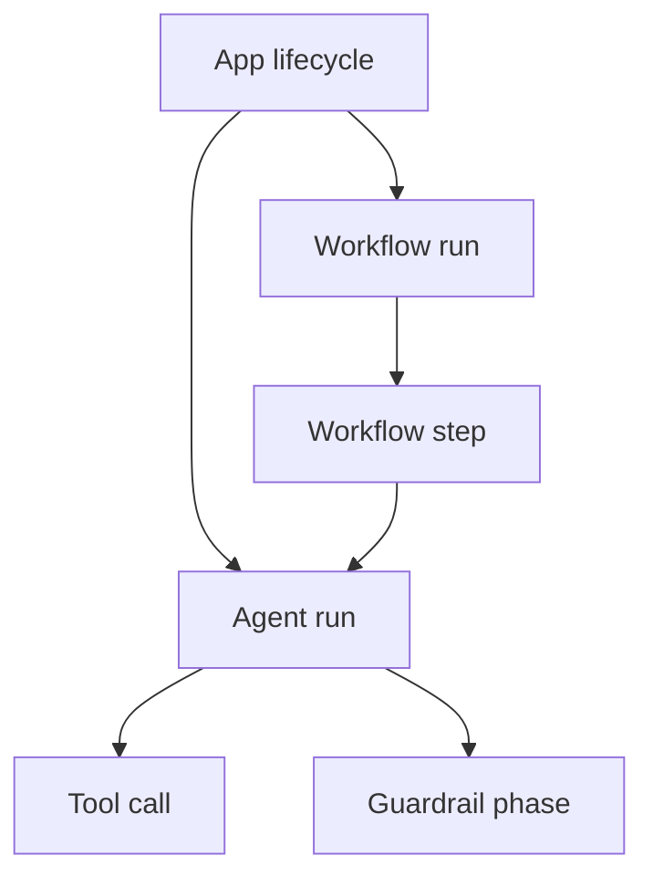

# Spec 080: Runtime Observability

## 1. Objetivo

Este documento define a observabilidade local de runtime da `gaal-lib`.

Os objetivos desta spec sao:

- definir logging estruturado para `App`, `Agent`, `Workflow` e `Guardrails`
- definir hooks locais de observabilidade e tracing sem dependencia de servico hospedado
- tornar normativa a propagacao de metadados minimos de correlacao entre os componentes do runtime
- preservar os eventos publicos ja definidos em `pkg/app`, `pkg/agent` e `pkg/workflow`
- estabelecer o que e observavel por logs, eventos e hooks, sem promover detalhes internos desnecessarios

Esta spec complementa a `Spec 000`, a `Spec 010`, a `Spec 020`, a `Spec 030`, a `Spec 031`, a `Spec 060` e a `Spec 070`.

Compatibilidade com a `Spec 010`:

- `Logger` continua feature obrigatoria, `P0`, com instrumentacao mais rica detalhada aqui
- `Observability hooks locais` continua feature local e sem dependencia hospedada
- esta spec detalha o contrato de observabilidade local, mas nao reclassifica por si so o status da matriz

Ficam fora do escopo desta spec:

- log aggregation, tracing centralizado, metricas SaaS, dashboards hospedados ou qualquer capacidade de VoltOps
- dependencia obrigatoria de OpenTelemetry, Prometheus, Jaeger, Grafana ou servico equivalente
- reescrita de eventos publicos ja emitidos ao consumidor
- elevacao automatica de qualquer evento interno a contrato publico estavel sem nova spec

## 2. Principios normativos

Os principios abaixo governam toda observabilidade local da biblioteca:

1. Observabilidade e local ao processo. Tudo que esta spec exige deve funcionar sem servico externo.
2. `context.Context` e `types.Metadata` sao a fronteira canonica de correlacao local.
3. Logs, hooks e eventos devem refletir o mesmo run real, sem identidades paralelas ou artificiais.
4. Eventos publicos existentes em `pkg/app`, `pkg/agent` e `pkg/workflow` sao a fonte primaria de observabilidade semantica.
5. Logging e hook sao observadores; nao podem alterar retroativamente o resultado do fluxo principal.
6. Panics em hooks de observabilidade devem ser recuperados pelo runtime e tratados como diagnostico local.
7. Nenhuma parte desta spec pode vazar `internal/*` para a API publica.

## 3. Escopo da observabilidade local

Esta spec reconhece quatro mecanismos complementares:

1. `eventos publicos`: eventos ja definidos nos contratos de `App`, `Agent` e `Workflow`
2. `logging estruturado`: registros locais com niveis, mensagem curta e metadados consistentes
3. `hooks locais`: observadores em processo para diagnostico, tracing local e integracoes opcionais
4. `metadados de correlacao`: chaves minimas propagadas entre camadas e eventos

Relacao normativa entre eles:

- eventos publicos definem o "o que aconteceu"
- logs estruturados definem "como isso ficou registrado localmente"
- hooks locais definem "como codigo do usuario ou adapters observam o acontecimento"
- metadados definem "como diferentes observacoes sao correlacionadas"

## 4. Eventos observaveis

### 4.1 Conjunto minimo por dominio

Esta spec adota como conjunto minimo de eventos publicos observaveis da v1:

#### App

- `app.starting`
- `app.started`
- `app.stopping`
- `app.stopped`
- `app.agent_registered`
- `app.workflow_registered`
- `app.bootstrap_failed`

#### Agent

- `agent.started`
- `agent.delta`
- `agent.tool_call`
- `agent.tool_result`
- `agent.guardrail`
- `agent.completed`
- `agent.failed`
- `agent.canceled`

#### Workflow

- `workflow.started`
- `workflow.step_started`
- `workflow.step_ended`
- `workflow.error`
- `workflow.finished`
- `workflow.ended`

#### Guardrails

`Guardrails` nao definem um stream de eventos publico proprio em pacote dedicado na v1.

A observabilidade minima de guardrails deve ocorrer por:

- `agent.guardrail` no dominio de `Agent`
- logs estruturados do runtime quando houver decisao observavel ou falha tecnica
- metadata associada a `workflow.error` quando um step adaptador encapsular falha classificada de guardrail

### 4.2 Regras normativas dos eventos

1. Eventos publicos continuam pertencendo aos seus pacotes de dominio (`pkg/app`, `pkg/agent`, `pkg/workflow`).
2. Esta spec nao promove novos eventos publicos obrigatorios alem dos ja definidos nas specs de dominio.
3. Eventos internos adicionais podem existir no runtime, mas nao devem ser tratados como contrato publico estavel nesta fase.
4. Um mesmo acontecimento nao deve produzir tipos publicos conflitantes em dominios diferentes.
5. Quando um `Workflow` encapsular um `Agent` por adapter, o workflow observa o step como unidade de trabalho; os eventos internos do agent continuam pertencendo ao dominio do agent.

## 5. Interface de logger

### 5.1 Contrato publico minimo

O contrato publico minimo de logging continua sendo a fachada definida em `pkg/logger`:

```go
package logger

type Logger interface {
    DebugContext(ctx context.Context, msg string, args ...any)
    InfoContext(ctx context.Context, msg string, args ...any)
    WarnContext(ctx context.Context, msg string, args ...any)
    ErrorContext(ctx context.Context, msg string, args ...any)
}
```

Regras normativas:

1. `pkg/logger` continua sendo a unica fachada publica obrigatoria de logging da v1.
2. O logger deve aceitar `context.Context` para preservar cancelamento e correlacao local.
3. O logger default continua sendo `logger.Nop()`, conforme a `Spec 031`.
4. O runtime nunca deve assumir que o logger concreto suporta recursos fora desta interface minima.
5. Adapters podem encapsular `slog`, `zap` ou outro backend local, desde que respeitem a interface publica.

### 5.2 Logging estruturado

Para fins desta spec, `logging estruturado` significa:

- mensagem curta e estavel por evento relevante
- pares chave/valor com metadados minimos consistentes
- nivel coerente com severidade e expectativa operacional
- ausencia de dependencia em formato textual especifico

Nao e exigido:

- formato JSON obrigatorio
- schema rigido de serializacao
- backend de exportacao remoto

## 6. Niveis de log

### 6.1 Niveis normativos

Os niveis observaveis da v1 sao:

- `debug`
- `info`
- `warn`
- `error`

### 6.2 Mapeamento minimo recomendado

O runtime deve respeitar, no minimo, o seguinte mapeamento semantico:

| Situacao | Nivel minimo esperado |
| --- | --- |
| inicio/fim bem-sucedido de startup e shutdown de `App` | `info` |
| registro materializado de agent/workflow | `debug` ou `info` |
| inicio e fim bem-sucedido de `Agent` e `Workflow` | `info` |
| `agent.delta` e eventos de alta frequencia | `debug` |
| tool call iniciada e concluida com sucesso | `debug` |
| guardrail com `allow` | `debug` |
| guardrail com `transform`, `drop` ou `block` | `info` ou `warn`, conforme impacto |
| guardrail com `abort` | `warn` |
| cancelamento cooperativo por contexto ou fechamento de stream | `info` |
| falha de modelo, tool, memory, workflow step ou startup | `error` |
| panic recuperado em hook | `error` |

### 6.3 Regras normativas dos niveis

1. `debug` deve ser reservado para granularidade alta ou diagnostico fino.
2. `info` deve representar transicoes e resultados esperados do runtime.
3. `warn` deve representar situacoes anormais, mas controladas, sem quebra do processo.
4. `error` deve representar falha terminal da operacao observada ou diagnostico de panic recuperado.
5. Um mesmo evento publico pode gerar log em nivel diferente conforme o resultado final associado.

## 7. Hooks de tracing locais

### 7.1 Objetivo

Os hooks de tracing locais existem para observar:

- inicio e fim de operacoes relevantes
- hierarquia local entre `App`, `Workflow`, `Agent`, `Tool` e `Guardrail`
- correlacao de eventos por `trace_id`, `span_id` e `parent_span_id`

Eles nao existem para:

- impor um tracer global obrigatorio
- exigir exporter remoto
- alterar o fluxo principal

### 7.2 Modelo normativo da v1

Na v1, tracing local e definido por:

1. uso de `context.Context` como portador da execucao corrente
2. uso de `types.Metadata` para expor correlacao observavel
3. hooks locais de `App`, `Agent` e `Workflow` como pontos de observacao

Esta spec reserva as seguintes chaves de metadata para correlacao:

- `trace_id`
- `span_id`
- `parent_span_id`

### 7.3 Regras normativas de tracing local

1. Quando presentes, `trace_id`, `span_id` e `parent_span_id` devem ser propagados sem mutacao semantica entre as camadas relevantes.
2. `trace_id` identifica a arvore local de correlacao do fluxo observavel.
3. `span_id` identifica a operacao observada pela camada corrente.
4. `parent_span_id` identifica a operacao observadora imediatamente superior, quando existir.
5. A ausencia dessas chaves nao invalida o runtime; significa apenas "sem correlacao explicita fornecida".
6. Quando o runtime gerar automaticamente correlacao local, ele deve usar as mesmas chaves reservadas e manter consistencia entre eventos, logs e hooks do mesmo fluxo.
7. Hooks de tracing continuam observadores; nao podem abrir dependencia obrigatoria em pacote publico novo nesta fase.

### 7.4 Formacao da hierarquia local

Hierarquia normativa recomendada:



Regras adicionais:

- um `Workflow` nao depende diretamente de `Agent` no core, mas um step adaptador pode propagar correlacao para o run do agent encapsulado
- `Tool` e `Guardrail` herdam a correlacao do run do `Agent` que os executa
- `App` e a raiz natural de correlacao para startup, shutdown e materializacao de registries

## 8. Metadados minimos

### 8.1 Chaves minimas

Toda observabilidade local relevante deve carregar, quando disponiveis, as seguintes chaves minimas:

- `app_name`
- `component`
- `event_type`
- `trace_id`
- `span_id`
- `parent_span_id`

Campos adicionais por dominio:

#### App

- `app_name`
- `state`
- `agent_name`, quando o evento tratar de agent registrado
- `workflow_name`, quando o evento tratar de workflow registrado

#### Agent

- `agent_id`
- `agent_name`
- `run_id`
- `session_id`

#### Workflow

- `workflow_id`
- `workflow_name`
- `run_id`
- `session_id`
- `step_name`, quando aplicavel
- `attempt`, quando aplicavel

#### Guardrail

- `phase`
- `guardrail_name`
- `action`
- `reason`, quando houver
- `chunk_index`, quando a fase for `stream`

#### Tool

- `tool_name`
- `tool_call_id`
- `tool_status`

### 8.2 Regras normativas dos metadados

1. Metadados devem ser clonados defensivamente antes de exposicao publica.
2. Chaves mais especificas podem sobrescrever chaves mais gerais apenas quando o significado permanecer observavel e coerente.
3. Metadados de correlacao nao devem ser apagados por componentes intermediarios sem justificativa explicita em spec propria.
4. Nenhum metadado deve exigir referencia a tipo de `internal/*`.
5. Campos opcionais ausentes nao invalidam o evento, desde que a ausencia seja coerente com o contexto observado.

## 9. Integracao com Agent

### 9.1 Regras normativas

1. `Agent` deve continuar emitindo seus eventos publicos definidos na `Spec 030`.
2. O metadata efetivo do run do `Agent` deve continuar sendo o merge de metadata do agent com metadata do request.
3. Logs de `Agent` devem reutilizar os mesmos ids observaveis do evento correspondente.
4. `Tool` e `Guardrail` executados dentro do agent devem herdar `run_id`, `agent_id`, `session_id` e correlacao de tracing local.
5. `agent.completed`, `agent.failed` e `agent.canceled` devem ser distinguiveis por evento e por nivel de log.
6. `EventGuardrail` continua sendo a fonte canonica de observabilidade semantica de guardrails no dominio do agent.
7. Panics em hooks de `Agent` devem ser recuperados e tratados como diagnostico local em log, sem alterar o resultado do run.

### 9.2 Tool e guardrail dentro do Agent

Ordem observavel recomendada:

1. `agent.started`
2. logs/hook de guardrails de input
3. logs/hook de tool call e tool result, quando ocorrerem
4. logs/hook de stream guardrails e `agent.delta`, quando houver stream
5. logs/hook de output guardrails
6. evento terminal do agent

## 10. Integracao com App

### 10.1 Regras normativas

1. `App` continua sendo a origem do logger global da aplicacao, conforme a `Spec 031`.
2. `App` deve propagar metadata global para seus proprios eventos e para defaults herdados por factories quando isso ja fizer parte do contrato de dominio.
3. Startup, shutdown, rollback de startup parcial e falha de bootstrap devem ser observaveis por evento e log.
4. `App` nao deve reescrever loggers privados de instancias prontas registradas diretamente.
5. Hooks de `App` observam lifecycle e bootstrap, mas nao substituem hooks de `Agent` nem de `Workflow`.

### 10.2 Materializacao de registries

Durante `Start` e `EnsureStarted`, os seguintes acontecimentos devem ser observaveis:

- inicio de startup
- registro materializado de agents
- registro materializado de workflows
- falha de factory, quando houver
- falha de `Server.Start`, quando houver
- cold start hook, quando houver
- transicao final para runtime pronto

## 11. Integracao com Workflow

### 11.1 Regras normativas

1. `Workflow` continua observavel pelos eventos definidos na `Spec 070`.
2. Metadata do workflow deve refletir o merge entre metadata do workflow e metadata do request do run.
3. Cada `step` deve ser observavel ao menos por `workflow.step_started` e `workflow.step_ended`, ou por `workflow.error` em falha.
4. Retry deve permanecer observavel por historico local e por logs, mesmo sem novo evento publico dedicado nesta fase.
5. Hooks de workflow observam a ordem cronologica real do run e devem receber metadados clonados defensivamente.

### 11.2 Integracao com Agent por adapter

Quando um step adaptador encapsular um `Agent`:

1. o workflow deve preservar sua propria identidade observavel (`workflow_id`, `workflow_name`, `run_id` do workflow)
2. o adapter pode projetar correlacao do workflow para o agent por `trace_id` e `parent_span_id`
3. o workflow nao deve absorver ou reemitir os eventos publicos internos do agent como se fossem eventos do workflow
4. falha do agent chega ao workflow como erro do step, sujeita a retry conforme a `Spec 070`

## 12. Integracao com Guardrails

### 12.1 Regras normativas

1. `Guardrails` continuam governados semanticamente pela `Spec 060`.
2. Esta spec apenas detalha como essas decisoes aparecem em logs, hooks e correlacao local.
3. Toda decisao observavel de guardrail deve continuar produzindo `agent.guardrail`.
4. Decisoes tecnicas invalidas de guardrail devem produzir falha do run e log em nivel `error`.
5. `transform`, `drop`, `block` e `abort` devem continuar distinguiveis por `phase`, `action` e metadados associados.

### 12.2 Metadados recomendados por decisao

Para `GuardrailDecision.Metadata`, os campos recomendados na v1 sao:

- `chunk_index`, quando a fase for `stream`
- `policy_id`, quando o guardrail possuir identificador estavel
- `rewrite_kind`, quando houver transformacao observavel

Esses campos sao opcionais, mas quando presentes devem ser tratados como diagnostico local e nao como contrato de controle de fluxo.

## 13. Regras de implementacao futura

As implementacoes futuras desta spec devem respeitar:

1. `pkg/logger` como fachada minima obrigatoria
2. ausencia de dependencia obrigatoria em backend de observabilidade externo
3. uso de `types.Metadata` como envelope publico de correlacao
4. preservacao dos eventos publicos ja definidos em specs de dominio
5. recuperacao de panic em hooks de observabilidade
6. uso de `pkg/app` como unica ponte publica entre adapters e runtime interno

Observacao arquitetural:

- um futuro `pkg/observability` pode ser promovido depois para contratos transversais, mas esta spec nao exige novo pacote publico para ser atendida

## 14. Criterios de aceitacao

Esta spec so pode ser considerada atendida quando:

1. o runtime puder registrar logs estruturados locais para `App`, `Agent`, `Workflow` e `Guardrails`
2. os eventos publicos minimos de `App`, `Agent` e `Workflow` permanecerem observaveis e semanticamente estaveis
3. `trace_id`, `span_id` e `parent_span_id` puderem ser propagados por metadata sem dependencia externa
4. o logger global do `App` puder ser reutilizado por runtime e adapters sem exigir backend especifico
5. hooks locais de observabilidade permanecerem observadores e seguros diante de panic
6. `Agent`, `Workflow`, `Tool` e `Guardrail` puderem compartilhar correlacao local coerente dentro do mesmo fluxo
7. metadados minimos de correlacao e identidade estiverem documentados por dominio
8. nenhuma parte da feature exigir VoltOps ou servico hospedado para funcionar localmente

## 15. Casos de teste obrigatorios

Toda implementacao futura desta spec deve cobrir, no minimo, os casos abaixo.

1. `App` emitindo eventos de startup e shutdown com metadata global clonada defensivamente.
2. `App` registrando falha de bootstrap com log e `app.bootstrap_failed`.
3. `logger.Nop()` permitindo execucao completa sem nil panic.
4. logger concreto recebendo `context.Context` e pares chave/valor estruturados.
5. `Agent` propagando metadata efetiva do run para seus eventos publicos.
6. `Agent` propagando `trace_id`, `span_id` e `parent_span_id` quando presentes no request.
7. tool call herdando `run_id`, `agent_id` e correlacao local do agent.
8. guardrail de input herdando metadata efetiva e identidade do run.
9. stream guardrail incluindo `chunk_index` observavel quando aplicavel.
10. output guardrail mantendo correlacao do mesmo run ate o evento terminal.
11. `agent.completed`, `agent.failed` e `agent.canceled` sendo distinguiveis por evento e por log.
12. panic em hook de `Agent` sendo recuperado e registrado sem derrubar o run.
13. panic em hook de `App` sendo recuperado e registrado sem derrubar o processo.
14. panic em hook de `Workflow` sendo recuperado e registrado sem alterar o resultado do workflow.
15. `Workflow` propagando metadata efetiva para `workflow.started`, `workflow.step_started`, `workflow.step_ended` e `workflow.ended`.
16. retry de workflow registrando logs coerentes por tentativa sem perder correlacao local.
17. adapter de step que encapsula `Agent` preservando correlacao entre workflow e agent por metadata.
18. falha classificada de guardrail dentro de agent step permanecendo observavel como erro do step no workflow.
19. eventos de alta frequencia, como `agent.delta`, podendo ser emitidos em nivel `debug`.
20. startup rollback de `App` preservando logs e eventos coerentes para diagnostico local.

## 16. Questoes em aberto

1. A v1 deve apenas propagar `trace_id` e spans por metadata, ou tambem deve expor helpers publicos para geracao local desses ids?
2. Um futuro `pkg/observability` merece entrar antes da implementacao rica, ou a v1 deve permanecer apoiada apenas em `pkg/logger`, hooks de dominio e `types.Metadata`?
3. O runtime deve registrar automaticamente todos os eventos publicos em log, ou apenas um subconjunto normativo com configuracao local posterior?
